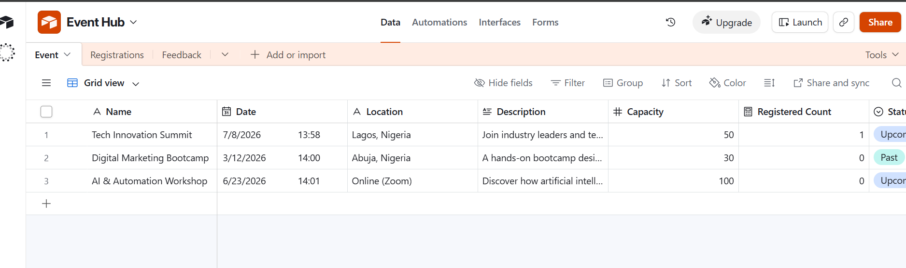
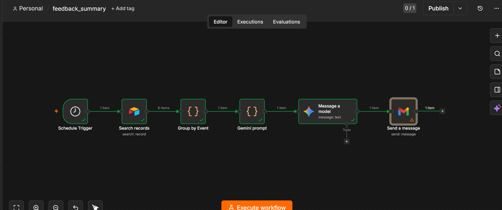

# EventHub — No-Code Event Management Platform

EventHub is a full-stack event management system built entirely with no-code/low-code tools. It allows organisers to publish events, lets attendees discover and register for them, automatically sends confirmation/waitlist emails, collects post-event feedback, and uses AI to summarise that feedback into actionable reports for organisers.

The project demonstrates how **Airtable**, **Softr**, **n8n**, and **Google Gemini** can be wired together to build a production-style application without writing traditional backend code.

---

## 📸 Screenshots

### Home Page — Event Listings


### Event Details — Register & Feedback


### Register Page


### My Tickets — Logged-in Attendee View


### Organiser Dashboard


### AI Feedback Report Email


### n8n Workflow — Confirmation & Waitlist


---

## 🧱 Tech Stack

| Layer | Tool | Purpose |
|---|---|---|
| Database | Airtable | Stores events, registrations, and feedback |
| Frontend / Portal | Softr | User-facing web app (public + authenticated pages) |
| Automation | n8n | Background workflows — emails & AI reporting |
| AI | Google Gemini | Generates feedback summary reports |
| Email | Gmail (via n8n) | Sends transactional emails |

---

## ✨ Features

- Public event listing and detail pages
- One-click event registration for logged-in users
- Automatic Confirmed / Waitlisted status handling
- Automated confirmation and waitlist emails (no duplicates)
- "My Tickets" page showing only the logged-in user's registrations
- Organiser Dashboard for managing all registrations, restricted by user group
- Post-event feedback form (only visible once an event's status is "Past")
- AI-generated feedback summary report emailed to the organiser every hour
- Role-based access control (Attendee vs Organiser)

---

## 🗄️ Database Schema (Airtable)

### `Events`
| Field | Type |
|---|---|
| Name | Single line text |
| Date | Date |
| Location | Single line text |
| Description | Long text |
| Capacity | Number |
| Status | Single select (Upcoming / Past) |
| Image URL | URL |

### `Registrations`
| Field | Type |
|---|---|
| Attendee Name | Single line text |
| Email | Email |
| Event | Linked record → Events |
| Status | Single select (Confirmed / Waitlisted) |
| Registration Date | Date/time |
| Event Name | Lookup (from Events) |
| Event Date | Lookup (from Events) |
| Event Location | Lookup (from Events) |
| Last Modified | Last Modified Time (system field, used for polling) |
| Email Sent | Checkbox (prevents duplicate automated emails) |

### `Feedback`
| Field | Type |
|---|---|
| Attendee Email | Email |
| Event | Linked record → Events |
| Rating | Number |
| Enjoyed | Long text |
| Improve | Long text |
| Return | Single select |
| Event Name | Lookup (from Events) |

---

## 🌐 Softr Pages

| Page | Access | Description |
|---|---|---|
| Home | Public | Lists all events with images |
| Events | Public | Full events directory |
| Event Details | Public | Event info, Register Now button, feedback form (Past events only) |
| Register | Logged-in users | One-click registration form |
| My Tickets | Logged-in users | Shows the current user's own registrations only |
| Organiser Dashboard | Organiser group only | View & edit all registrations |
| Feedback Form | Logged-in users | Submits post-event feedback |

**Access control** is enforced both at the page level (Visibility settings) and at the data level (record filters scoped to the logged-in user's email).

---

## ⚙️ n8n Workflows

### Workflow 1 — Registration Confirmation

**Trigger:** Schedule Trigger (every 1 minute)

**Flow:**
```
Schedule Trigger
   → Search Records (Airtable: Registrations, filtered to
       records modified in the last minute AND Email Sent = false)
   → IF: Status = "Confirmed"
        TRUE  → Send Confirmation email → Mark Email Sent = true
        FALSE → IF: Status = "Waitlisted"
                  TRUE  → Send Waitlist email → Mark Email Sent = true
                  FALSE → No Operation
```

This design avoids n8n's unreliable native Airtable Trigger node and instead uses a Schedule Trigger + filtered Search, which is more stable and prevents duplicate sends via the `Email Sent` flag.

### Workflow 2 — Feedback Summary Report

**Trigger:** Schedule Trigger (every 1 hour)

**Flow:**
```
Schedule Trigger
   → Airtable: Get all Feedback records
   → Code node: group responses by event, filter events with 3+ responses
   → Code node: build a structured prompt per event
   → Google Gemini: generate report (Key Highlights, Common Praise,
       Areas for Improvement, Overall Sentiment)
   → Code node: convert markdown bold (**text**) to HTML <b> via regex
   → Gmail: email the formatted HTML report to the organiser
```

---

## 🐛 Issues Fixed During Development

| Issue | Fix |
|---|---|
| Event date/location not showing in Registrations | Added lookup fields in Airtable |
| Date displaying as raw ISO string | Formatted using `toLocaleDateString` |
| Gemini `**bold**` rendering as plain text | Regex-replaced markdown bold with HTML `<b>` tags |
| Gemini response path returning `undefined` | Corrected to `content.parts[0].text` |
| Feedback showing "Unknown Event" | Added Event Name lookup + linked records |
| Feedback form visible on all events | Added visibility condition: Status = Past |
| Airtable Trigger throwing "No bridge acquired" | Replaced native Airtable Trigger with Schedule Trigger + Search Records |
| Duplicate confirmation emails sent every minute | Added `Email Sent` checkbox + Update Record node to mark processed records |
| Waitlist email firing for unrelated status changes | Split logic into two sequential IF nodes (Confirmed → Waitlisted) |
| `Event Name[0]` causing `.split()` undefined error | Removed array index since lookup field renders as plain text |
| Attendee Name/Email not captured from Softr form | Diagnosed as unauthenticated test submissions; fixed by enforcing "Logged-in users only" on the Register page/form |
| My Tickets page showing other users' data | Added record-level filter: `Email = Logged-in user > Email` |
| Home page leaking attendee names | Removed Registrations field from public event cards |
| Organiser Dashboard accessible to all users | Created condition-based "Organiser" user group restricted by email |

---

## 🔐 Access Control Summary

| Role | Can Access |
|---|---|
| Public (not logged in) | Home, Events, Event Details |
| Logged-in attendee | + Register, My Tickets, Feedback Form |
| Organiser (user group) | + Organiser Dashboard (view & edit all registrations) |

---

## 📁 Repository Structure

```
eventhub/
├── README.md
├── n8n-workflows/
│   ├── confirmation-waitlist.json
│   └── feedback-summary-report.json
├── docs/
│   ├── airtable-schema.md
│   └── softr-pages-overview.md
└── screenshots/
    ├── home-page.png
    ├── event-details.png
    ├── register-page.png
    ├── my-tickets.png
    ├── organiser-dashboard.png
    ├── feedback-report-email.png
    └── n8n-workflow.png
```

---

## 🚀 Setup / Reproduction Guide

1. **Airtable:** Duplicate the base structure described above, including the `Last Modified` and `Email Sent` fields on Registrations.
2. **Softr:** Connect to your Airtable base and recreate the 7 pages, applying the visibility rules listed above.
3. **n8n:**
   - Import `confirmation-waitlist.json` and `feedback-summary-report.json` from `n8n-workflows/`
   - Add your Airtable Personal Access Token (scopes: `data.records:read`, `data.records:write`, `schema.bases:read`)
   - Add your Gmail and Google Gemini credentials
   - Activate (publish) both workflows
4. **Test:** Register as a test user on the live Softr portal and confirm the confirmation email arrives within a minute.

---

## 📌 Notes

- This project was built as a portfolio/assignment piece to demonstrate no-code full-stack architecture (database, frontend, auth, automation, and AI integration) without traditional backend code.
- Airtable's native `Airtable Trigger` node in n8n was found to be unreliable in this environment; the Schedule Trigger + Search Records pattern is recommended as a more robust alternative for similar projects.

---

## 📄 License

This project is provided for educational/portfolio purposes.
